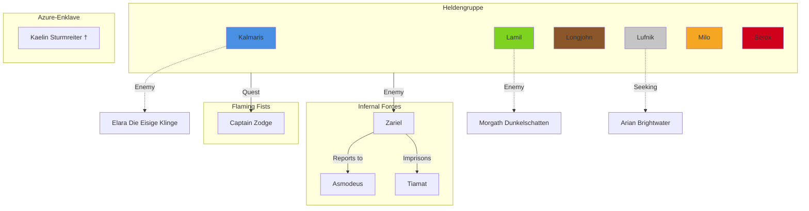

# Feature: NPC Relationship Mapper

**Category**: Quest & Story
**Priority**: Medium
**Complexity**: High
**Status**: Not Started

## Overview

Parse markdown files to identify NPC mentions and automatically generate relationship diagrams showing connections between characters, factions, and locations. Creates a visual network map of the campaign's social structure.

## User Story

Als Spielleiter möchte ich eine visuelle Karte aller NPC-Beziehungen, Fraktionsverbindungen und Charakterinteraktionen, damit ich komplexe soziale Dynamiken nachvollziehen kann und interessante Storyline-Verknüpfungen erkenne.

## Requirements

### Must-Haves

1. **NPC Detection**
   - Extract NPC names from campaign files
   - Parse NPC files in campaign directories
   - Identify recurring character mentions across sessions
   - Build master NPC database with first appearance dates

2. **Relationship Identification**
   - Detect explicit relationships (family, friends, enemies)
   - Identify implicit connections (co-location, faction membership)
   - Track PC-NPC relationships
   - Track NPC-NPC relationships
   - Identify faction affiliations

3. **Relationship Types**
   - **Positive**: Ally, Friend, Family, Mentor, Loyal to
   - **Negative**: Enemy, Rival, Betrayed by, Hunts
   - **Neutral**: Acquaintance, Business, Knows of
   - **Faction**: Member of, Leader of, Works for
   - **Location**: Lives in, Rules, Operates in

4. **Visual Output**
   - Generate network graph diagram
   - Use mermaid.js for markdown-embedded diagrams
   - Create standalone HTML visualization
   - Color-code by relationship type
   - Size nodes by importance/frequency

5. **Integration with Existing NPCs**
   - Parse `03 Avernus/Avernus_NPCs_Deutsch.md`
   - Extract NPCs from `02 Baldurs Gate/` factions
   - Include major NPCs from all three arcs

### Should-Haves

1. **Interactive Features**
   - Clickable nodes linking to NPC detail pages
   - Filter by: faction, location, relationship type, arc
   - Search for specific NPCs
   - Expand/collapse faction groups

2. **Relationship Strength**
   - Weak/Medium/Strong connection indicators
   - Line thickness represents relationship strength
   - Frequency of mentions = stronger visual connection

3. **Timeline Integration**
   - Show how relationships evolved over time
   - Animate relationship formation/dissolution
   - Highlight new relationships per arc

4. **Faction Visualization**
   - Group NPCs by faction membership
   - Show faction hierarchies
   - Display inter-faction relationships

### Nice-to-Haves

1. **AI Relationship Inference**
   - Use NLP to detect implicit relationships
   - Suggest missing relationships based on context
   - Auto-categorize relationship types

2. **Conflict Detection**
   - Identify potential conflicts (enemy of ally)
   - Highlight contradictory relationships
   - Suggest story tension points

3. **Character Centrality Analysis**
   - Calculate most-connected NPCs
   - Identify key "hub" characters
   - Suggest important NPCs for plot development

## Story Integration Points

### Known NPCs by Arc

**Arc 1: Moreva & Deep Underground**
- Shadow Dragon (Moreva) - Enemy → Defeated
- Waldwächter (Forest) - Ally → Healed forest
- Jäger with letter for daughter - Neutral → Quest giver
- Feuergott (Fire God) - Ally → Imprisoned, helped in battle
- Zwerg Patrouille - Allies → Guided to city

**Arc 2: Baldur's Gate**

*Faction Leaders:*
- **Kaelin Sturmreiter** (Azure-Enklave) - Ally → Died at auction
- **Garrick der Scharfschütze** (Eiserner Zirkel) - Neutral → Died at auction
- **RR-Gilde Leaders** - Enemy (after Milo rescue)

*Key NPCs:*
- **Handelskarawanenführer** - Neutral → Transported party
- **Dr. Thallus** (Widowhall) - Ally → Sealed Kalmaris' demon
- **Peeblewitz Steinguckern** - Temporary ally → Tourist/insurance agent
- **Doppelgänger-Milo** - Enemy → Defeated
- **Blobulus** (Evil Blob) - Enemy → Defeated

**Arc 3: Avernus**

From `Avernus_NPCs_Deutsch.md`:
- **Captain Zodge** (Flaming Fists) - Quest giver → Sent party to Avernus
- **Erzherzogin Zariel** - Main antagonist → Rules Avernus
- **Asmodeus** - Cosmic power → Lord of Nine Hells
- **Tiamat** - Imprisoned goddess → Unknown relationship
- Various Avernus inhabitants (to be detailed)

*Character-Specific NPCs:*
- **Kapitänin Elara "Die Eisige Klinge"** - Kalmaris' enemy
- **Morgath Dunkelschatten** - Lamil's enemy
- **Arian Brightwater** - Lufnik's missing friend
- **Scarred Pirate Captain** - Longjohn's revenge target

### Faction Structure

```
Azure-Enklave (Nature/Magic focused)
├─ Kaelin Sturmreiter (Leader) ✝
├─ Lamil (Member)
└─ [Other members]

Eiserner Zirkel (Mercenary Guild)
├─ Garrick der Scharfschütze ✝
└─ [Unfriendly to party]

RR-Gilde (Mysterious Research)
├─ [Leaders unknown]
├─ Imprisoned Milo
└─ Status: Enemy of party

Mechaniker-Kollektiv (Tinkers/Alchemists)
├─ Milo (Member)
└─ Status: Friendly

Arkanum-Turm (Arcane Studies)
├─ Lufnik (Attempted to join)
└─ Status: Neutral

Flaming Fists (Military/Guard)
├─ Captain Zodge
└─ Status: Quest givers

Party Members (Player Characters)
├─ Kalmaris (Former Pirate → Identity Lost)
├─ Lamil (Wildfire Druid)
├─ Longjohn (Revenge Seeker)
├─ Lufnik (Moon-touched)
├─ Milo (Alchemist/Narrator)
└─ Serox (Smith/Armor Seeker)

Smaragdkrähe (Pirate Ship)
├─ Kalmaris (Former Member)
└─ Status: Past connection lost

Infernal Forces (Avernus)
├─ Asmodeus (Lord of Hells)
├─ Zariel (Archduchess of Avernus)
├─ Tiamat (Imprisoned)
└─ Various Devils/Demons
```

### Key Relationships to Map

**Player Character Relationships:**
- All 6 PCs are close allies (party bond)
- Kalmaris + Longjohn: Former pirates, shared background
- Serox + Milo: Crafting connection (Milo gave Serox enchanted hammer)
- Lamil + Nature spirits: Druidic connection

**Faction Relationships:**
- Azure-Enklave ↔ Party: Strong ally
- RR-Gilde ↔ Party: Enemy (after rescue mission)
- Mechaniker-Kollektiv ↔ Milo: Member
- Eiserner Zirkel ↔ Party: Unfriendly

**Personal Enemy Relationships:**
- Kalmaris ↔ Elara "Die Eisige Klinge": Enemy
- Lamil ↔ Morgath Dunkelschatten: Enemy
- Longjohn ↔ Scarred Pirate Captain: Revenge target

**Quest Relationships:**
- Party ↔ Captain Zodge: Quest giver
- Party ↔ Zariel: Antagonist (must defeat/negotiate)
- Lufnik ↔ Arian Brightwater: Missing friend (seeking)

## Technical Implementation

### n8n Workflow Steps

1. **File Watcher Node**
   - Monitor NPC files for changes
   - Monitor session files for NPC mentions
   - Trigger map regeneration on updates

2. **File Reader Nodes**
   - Read `Avernus_NPCs_Deutsch.md`
   - Read all session files
   - Read character files
   - Read faction documents

3. **Function Node: NPC Extractor**
   ```javascript
   // Extract NPC names from:
   // - Dedicated NPC files
   // - Headers mentioning names
   // - Bold text with names (**Captain Zodge**)
   // - Dialogue attribution ("X said...")

   // Build NPC database:
   // {
   //   name: "Captain Zodge",
   //   firstAppearance: "Tag 135",
   //   faction: "Flaming Fists",
   //   locations: ["Elturel Crater"],
   //   mentionCount: 5
   // }
   ```

4. **Function Node: Relationship Parser**
   ```javascript
   // Detect relationships from text patterns:
   // "X is Y's enemy"
   // "X works for Y"
   // "X betrayed Y"
   // "X and Y fought together"
   // "X is member of [Faction]"

   // Infer relationships from co-occurrence:
   // NPCs mentioned in same session = acquainted
   // NPCs in same faction = connected
   // NPCs in same location = potentially know each other
   ```

5. **Function Node: Graph Generator**
   ```javascript
   // Create graph data structure:
   // nodes = NPCs + Factions + PCs
   // edges = relationships with types and weights

   // Calculate:
   // - Node size (by mention frequency)
   // - Edge thickness (by relationship strength)
   // - Node color (by faction or type)
   ```

6. **Template Node: Mermaid Diagram**
   ```javascript
   // Generate mermaid.js syntax:
   graph TD
     Kalmaris[Kalmaris<br/>PC]
     Elara[Elara Die Eisige Klinge<br/>Enemy]
     Kalmaris -.enemy.-> Elara
   ```

7. **Template Node: HTML Visualization**
   - Use vis.js or D3.js for interactive graph
   - Apply fantasy theme styling
   - Add zoom, pan, filter controls

8. **File Writer Nodes**
   - Save `NPC-Relationships.md` with mermaid diagrams
   - Save `NPC-Relationships.html` interactive version
   - Save `NPC-Database.json` for other tools

### Data Structure

```markdown
# NPC Beziehungsnetzwerk
*Automatisch generiert - Tag 145*

## Übersicht
- **Gesamt NPCs**: 45
- **Fraktionen**: 8
- **Beziehungen**: 87

---

## Hauptnetzwerk



---

## Beziehungsdetails

### Captain Zodge ↔ Party
**Type**: Quest Giver
**Strength**: Medium
**Status**: Active
**First Interaction**: Tag 135
**Last Interaction**: Tag 136

Zodge beauftragte die Party, nach Avernus zu reisen und Elturel zu retten.

---

### Kalmaris ↔ Elara "Die Eisige Klinge"
**Type**: Enemy
**Strength**: Strong
**Status**: Active (Unresolved)
**History**:

Elara ist eine gnadenlose Piratin und Kalmaris' Erzfeindin. Sie regiert die Handelsrouten mit eiserner Hand. Mehrere Konfrontationen, bisher immer knapp entkommen.

---

[...weitere Beziehungen...]

---

## NPCs nach Fraktion

### Azure-Enklave
- Kaelin Sturmreiter (Leader) † - Died Tag 95
- Lamil (PC Member)

### Flaming Fists
- Captain Zodge (Quest Giver)

### Eiserner Zirkel
- Garrick der Scharfschütze † - Died Tag 95

[...weitere Fraktionen...]

---

## Wichtigste NPCs (nach Verbindungen)

1. **Captain Zodge** - 6 connections
2. **Zariel** - 5 connections
3. **Milo** - 8 connections (party + faction)
4. **Kalmaris** - 7 connections

---

## Neue NPCs (letzten 10 Sessions)

- Tag 145: [Fort Knucklebone NPCs]
- Tag 140: [High Hall NPCs]
- Tag 136: [Avernus Entry NPCs]
```

### Graph Visualization Types

1. **Full Network Map** - All NPCs and relationships
2. **Faction Map** - Grouped by factions, showing hierarchy
3. **PC-Centric Map** - Each PC with their personal connections
4. **Antagonist Web** - All enemies and their connections
5. **Location-Based Map** - NPCs grouped by current location

## Dependencies

- Read access to all campaign files
- Write access for generated maps
- Mermaid.js for markdown diagrams
- vis.js or D3.js for interactive HTML graphs
- Optional: AI for relationship inference

## Testing Criteria

- [ ] Extracts at least 30 NPCs from campaign files
- [ ] Identifies all 6 PC relationships correctly
- [ ] Maps all major faction memberships
- [ ] Generates valid mermaid.js syntax
- [ ] HTML visualization is interactive and zoomable
- [ ] Color coding is consistent
- [ ] Links to NPC detail pages work
- [ ] Regenerates map in under 30 seconds

## Success Metrics

- DM uses map for session planning weekly
- Players reference map to remember NPCs
- Identifies at least 5 story connections DM hadn't noticed
- Reduces "who was that?" questions by 70%
- Map contains 40+ NPCs and 80+ relationships

## Related Features

- **Quest Progress Dashboard** - Link quests to quest-giver NPCs
- **Automatic Timeline Generation** - Show when NPCs first appeared
- **Session Summary Generator** - Extract NPC mentions from summaries
- **Auto-Wiki Link Generator** - Link NPC names to wiki pages

## Implementation Notes

### Phase 1: Manual NPC Database (MVP)
1. Create master NPC list manually
2. Define key relationships explicitly
3. Generate simple mermaid diagram

### Phase 2: Automated Extraction
1. Build NPC name extraction from files
2. Detect co-occurrence relationships
3. Generate relationship database

### Phase 3: Visual Enhancement
1. Implement interactive HTML visualization
2. Add filtering and search
3. Apply fantasy theme styling

### Phase 4: AI Enhancement
1. Use NLP to infer implicit relationships
2. Auto-categorize relationship types
3. Suggest missing relationships

## Campaign-Specific Configuration

```json
{
  "npcFilePaths": [
    "03 Avernus/Avernus_NPCs_Deutsch.md",
    "02 Baldurs Gate/factions/*.md",
    "characters/*/enemies.md"
  ],
  "playerCharacters": [
    "Kalmaris", "Lamil", "Longjohn",
    "Lufnik", "Milo", "Serox"
  ],
  "factions": [
    "Azure-Enklave",
    "Eiserner Zirkel",
    "RR-Gilde",
    "Mechaniker-Kollektiv",
    "Arkanum-Turm",
    "Flaming Fists",
    "Smaragdkrähe",
    "Infernal Forces"
  ],
  "relationshipTypes": {
    "ally": {"color": "#7ED321", "style": "solid"},
    "enemy": {"color": "#D0021B", "style": "dashed"},
    "neutral": {"color": "#C5C5C5", "style": "dotted"},
    "faction": {"color": "#F5A623", "style": "bold"},
    "family": {"color": "#FF6B9D", "style": "double"}
  },
  "minimumMentions": 2,
  "includeDeadNPCs": true
}
```

## Example NPC Database Entry

```json
{
  "name": "Captain Zodge",
  "faction": "Flaming Fists",
  "status": "alive",
  "firstAppearance": "Tag 135",
  "lastAppearance": "Tag 136",
  "mentionCount": 5,
  "locations": ["Elturel Crater", "Outside Elturel"],
  "relationships": [
    {
      "target": "Party",
      "type": "quest_giver",
      "strength": "medium",
      "description": "Sent party to rescue Elturel"
    },
    {
      "target": "Flaming Fists",
      "type": "member",
      "strength": "strong",
      "description": "Captain in the organization"
    }
  ],
  "description": "Captain der Flaming Fists, beauftragte die Gruppe nach Avernus zu reisen",
  "tags": ["military", "quest_giver", "authority"]
}
```
